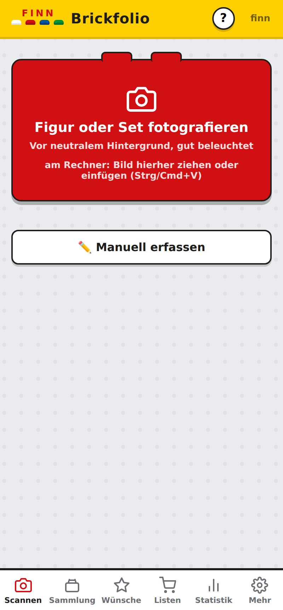
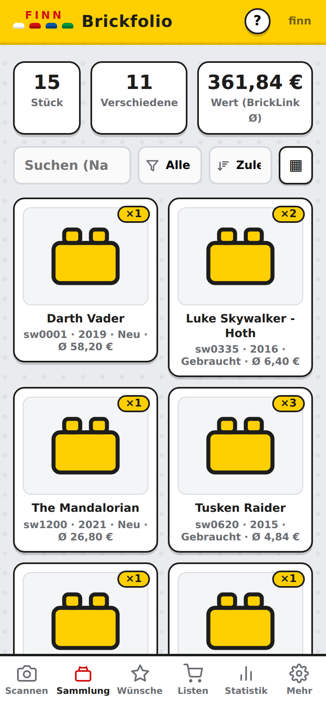
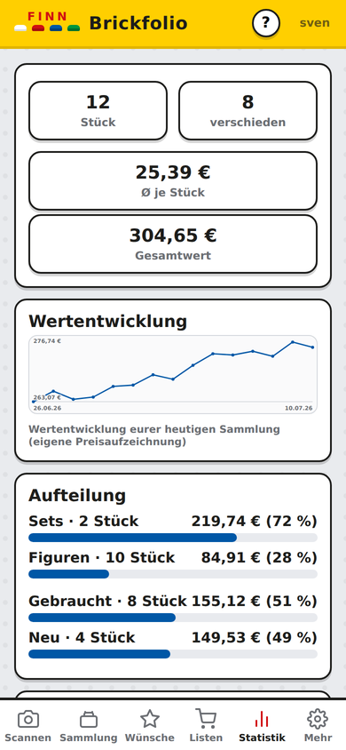
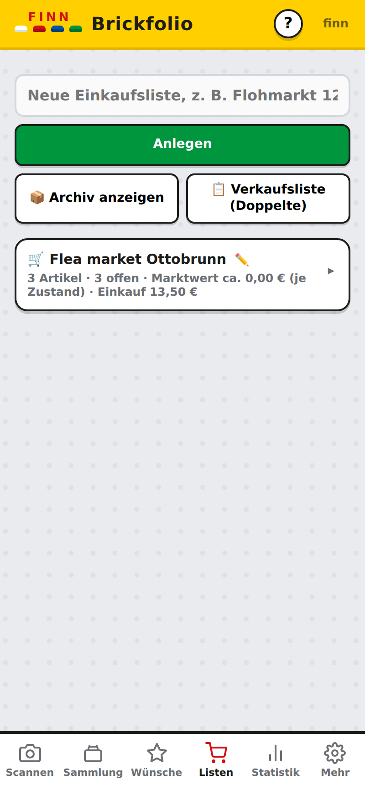

# Finn's Brickfolio 🧱

*[🇬🇧 English](README.en.md) · 🇩🇪 Deutsch*

[](https://buymeacoffee.com/melle79)
[](LICENSE)

Selbstgehostete PWA zum Scannen, Verwalten und Bewerten einer LEGO®-Sammlung –
gebaut für die ganze Familie auf einer gemeinsamen Datenbank, mit optionalem
**Sammlerprofi-Modus** für alle, die auf Flohmärkten kaufen und verkaufen.

**Foto → Erkennung → Sammlung.** Die Erkennung läuft über die kostenlose
[Brickognize-API](https://brickognize.com); Preise, Set-Inhalte und Metadaten
kommen von [BrickLink](https://www.bricklink.com) und
[Rebrickable](https://rebrickable.com) (eigene API-Keys nötig, siehe unten).

> 📖 Das ausführliche **Benutzerhandbuch** liegt unter
> [`docs/HANDBUCH.md`](docs/HANDBUCH.md).

## Funktionen

**Erfassen & Verwalten**
- 📷 Figuren und Sets direkt mit der Handykamera scannen (Kandidatenliste mit
  Trefferscore) oder per Name/Nummer suchen – reine Nummern werden automatisch
  als Set *und* Figur nachgeschlagen
- 📦 Mengen, Zustand (neu/gebraucht), Notizen, Bildergalerie, Volltextsuche
  (mit 🔍-Symbol und ✕ zum Leeren), Sortierung und Typ-Filter
- 🔎 Katalogsuche ab drei Zeichen, **10 Treffer pro Seite** mit „Weitere
  Ergebnisse laden" – alle Treffer sind erreichbar
- 👥 **Figuren beim Set übernehmen**: Beim Hinzufügen eines Sets fragt die App,
  welche der enthaltenen Minifiguren dabei sind (alle, keine oder eine Auswahl,
  inklusive Zustand) – ohne den Gesamtwert doppelt zu zählen
- 👥 Set-Vernetzung: Sets kennen ihre Figuren („👥 3/4 ✔"-Vollständigkeit),
  Figuren zeigen, in welchen euren Sets sie stecken; fehlende Set-Figuren
  landen mit einem Tipp gesammelt auf der Wunschliste
- 🖼 **Bild nachladen** je Eintrag, falls es fehlt oder nicht passt

**Preise & Wert**
- 💶 BrickLink-Ø-Preise (neu/gebraucht) automatisch im Hintergrund, mit
  eigener **Preisverlaufs-Aufzeichnung** und Chart pro Artikel
- 🌍 **Preisgebiet wählbar** (Mehr → Preisgebiet): weltweit, Deutschland,
  Österreich, Schweiz oder Europa – ohne Verkäufe im gewählten Gebiet weitet die
  App zweistufig aus (erst Europa, dann weltweit). Bestehende Preise lassen sich
  schrittweise umrechnen, preislose Artikel per Knopfdruck neu abrufen
- 📊 **Statistik-Tab**: Kennzahlen, Wertentwicklung der Gesamtsammlung,
  Aufteilung nach Typ/Zustand, Wert nach Erscheinungsjahr, Top 10

**Wunschliste**
- ⭐ Merken aus jedem Scan/Suchergebnis, Ø-Preis-Widgets, „Gekauft"-Übernahme
  in die Sammlung inkl. Zustandswahl
- 🧩 Figuren, die zu einem eurer Sets gehören und noch fehlen, sind mit „fehlt
  zu eurem Set" gekennzeichnet – ein Tipp springt direkt zum Set

**Sammlerprofi-Modus** (Rolle, die der Admin pro Benutzer vergibt)
- 💰 Kaufpreis je Eintrag – automatisch mit dem BrickLink-Ø vom Erfassungstag
  vorbelegt (⚙️) oder manuell (✏️), mit Gewinn-/Verlust-Anzeige
- 🛒 **Einkaufslisten** für den Flohmarkt: befüllen per Scan, Marktwert live,
  Einkaufspreis je Artikel, **Gesamtangebot** mit anteiliger Verteilung nach
  Marktwert und 60-%-Preisvorschlag
- 📋 **Verkaufsliste**: alle Doppelten mit abgebbarer Menge und Verkaufswert –
  für eigene Sets gebrauchte Figuren bleiben reserviert, von allem anderen
  bleibt ein Behalte-Exemplar
- 🧩 **Fehlende Set-Figuren**: über alle eigenen Sets hinweg, welche Figuren
  noch fehlen (mit Anzahl, Sets, Nachkaufpreis) – einzeln oder alle auf die
  Wunschliste, als CSV oder Druckliste
- 🗒 Beim Verbuchen von einer Einkaufsliste landet der **Listenname in den
  Notizen** des Sammlungs-Eintrags (Herkunft bleibt nachvollziehbar)
- 📈 Zusätzliche Statistik: bezahlt gesamt, Gewinn, beste Wertsteigerungen

**Familie & Betrieb**
- 🔐 Mehrbenutzer mit Token-Login (PBKDF2-gehashte Passwörter), Admin- und
  Profi-Rollen, eigene Passwort-/Namensänderung
- 💾 Komplett-**Sicherung** als JSON (herunterladen & wieder einspielen),
  CSV-Export und druckfertige Listen
- 🏷 Konfigurierbarer **Anzeigename** in Logo und Titel (Standard „Finn");
  ideal, wenn mehrere Familienmitglieder je eine eigene Instanz betreiben
- 🌌 Zwei **Designs** zur Auswahl (Mehr → Design): „Klassisch" hell und
  „Galaxie" dunkel mit Sternenhimmel – die Wahl gilt pro Gerät
- 🔔 **Hinweise auf dem Startbildschirm**: Ändert oder löscht BrickLink eine
  Nummer aus eurer Sammlung, steht das im Scannen-Tab – und bleibt dort, bis es
  jemand wegklickt. Die neue Nummer sucht die App im BrickLink Catalog Change
  Log und trägt sie auf Knopfdruck überall ein
- 🐞 **Fehlerbericht** (Mehr → Fehlerbericht, Admin): Fehler aus allen Geräten
  melden sich automatisch am eigenen Server und werden gleichartig
  zusammengefasst. Mit hinterlegtem GitHub-Token legt ein Klick daraus ein
  Issue an; API-Schlüssel und Token werden vorher aus dem Text entfernt
- 🖥 **Reagiert auf die Bildschirmbreite**: auf dem Handy Tab-Leiste unten, am
  Rechner Seitenleiste links mit breiterem Raster (vier bis fünf Karten pro
  Reihe) – dieselbe App, nur besser auf die Fläche verteilt
- 📲 Als PWA installierbar, Offline-Shell, keine Cloud – alles bleibt auf
  eurem Server

## Screenshots

| Scannen | Sammlung |
|:---:|:---:|
|  |  |
| **Statistik** | **Einkaufsliste (Flohmarkt-Modus)** |
|  |  |

*(Screenshots mit Demo-Daten)*

## Schnellstart (Docker)

```bash
git clone https://github.com/Melle79/brickfolio.git
cd brickfolio
cp docker-compose.example.yml docker-compose.yml
docker compose up -d --build
```

Aufrufen: `http://<server>:8300` – beim ersten Besuch führt die App durch
die **Ersteinrichtung** (Admin-Konto anlegen). Die Datenbank liegt
persistent unter `./data/brickfolio.db`.

**Ohne git** (z. B. auf Synology-NAS, wo git meist fehlt) – das neueste
Release als Archiv laden:

```bash
mkdir brickfolio && cd brickfolio
curl -sL https://github.com/Melle79/brickfolio/archive/refs/heads/main.tar.gz | tar xz --strip-components=1
cp docker-compose.example.yml docker-compose.yml
docker compose up -d --build
```

### Synology NAS

Ordner unter `/volume1/docker/brickfolio` anlegen und die Befehle per SSH
mit `sudo` ausführen (bei der curl-Variante: `sudo sh -c 'curl … | tar …'`,
damit die ganze Pipe mit Rechten läuft).

## Konfiguration

| Variable | Pflicht | Beschreibung |
|---|---|---|
| `ADMIN_USER` / `ADMIN_PASSWORD` | nein | Optional: Admin automatisch anlegen (sonst Ersteinrichtung im Browser) |
| `DB_PATH` | nein | Pfad zur SQLite-Datei (Default im Container: `/data/brickfolio.db`) |
| `BL_CONSUMER_KEY` / `BL_CONSUMER_SECRET` / `BL_TOKEN` / `BL_TOKEN_SECRET` | nein | BrickLink-Store-API für Preise & Set-Inhalte ([Key beantragen](https://www.bricklink.com/v2/api/register_consumer.page)) |
| `BACKUP_KEEP` | nein | Automatische tägliche Sicherungen aufbewahren (Standard 14, 0 = aus) |
| `REBRICKABLE_KEY` | nein | Rebrickable-API für die Namenssuche ([Key erstellen](https://rebrickable.com/api/)) |
| `GITHUB_REPO` | nein | Ziel-Repository für Issues aus dem Fehlerbericht (Default `Melle79/brickfolio`) |

Alle API-Keys lassen sich alternativ **in der App** hinterlegen
(Mehr → API-Schlüssel, nur Admin) – ENV-Variablen dienen als Fallback.

## Rechte-Übersicht

| Aktion | Standard | Sammlerprofi | Admin |
|---|:-:|:-:|:-:|
| Scannen, Sammlung, Wünsche, Statistik | ✔ | ✔ | ✔ |
| Einkaufslisten sehen & Artikel „ist da" verbuchen | ✔¹ | ✔ | ✔¹ |
| Listen anlegen/befüllen/archivieren, Gesamtangebot, Verkaufsliste | – | ✔ | – |
| Kaufpreise & Gewinn sehen | – | ✔ | – |
| Benutzer, Rollen, API-Keys, Sicherung | – | – | ✔ |

¹ Tab erscheint nur, wenn mindestens eine aktive Liste existiert.
Rollen sind kombinierbar (der Admin kann sich selbst zum Profi machen).

## Updates & Backup

- Neue Version einspielen: Dateien ersetzen, dann
  `docker compose up -d --build` – Datenbank-Migrationen laufen automatisch.
  Bequemer geht es mit `sudo bash update.sh` im Projektordner.

### Update aus der App heraus (optional)

**Völlig optional** – ohne Einrichtung ändert sich nichts, Updates laufen wie
gehabt über `update.sh` per SSH. Der Knopf in der App erscheint erst, wenn der
Helfer unten eingerichtet ist; vorher steht dort nur ein Hinweis darauf.

**Wie es funktioniert.** Die App führt das Update **nicht selbst** aus – sie
kann es gar nicht, denn sie läuft im Container. Sie legt nur die Markierung
`data/update-requested.json` ab. Ein kleines Skript auf dem Server greift die
auf und startet `update.sh`. So braucht die App **keinen Docker-Zugriff** –
den ins Container zu reichen käme faktisch Root auf dem Server gleich.

#### Einrichten

`update-watch.sh` regelmäßig aufrufen lassen. **Ein Takt von einer Minute
reicht** – das Update selbst dauert ohnehin ein bis drei Minuten.

**Synology (DSM):** Systemsteuerung → Aufgabenplaner → Erstellen →
Geplante Aufgabe → Benutzerdefiniertes Skript

| Reiter | Einstellung |
| --- | --- |
| Allgemein | Benutzer: **`root`** (sonst darf das Skript kein `docker compose`) |
| Zeitplan | Täglich · Start `00:00` · „Weiterhin innerhalb desselben Tages ausführen" ✔ · Wiederholen: **jede Minute** · Letzte Ausführungszeit: **`23:59`** |
| Aufgabeneinstellungen | Befehl: `sh /pfad/zu/brickfolio/update-watch.sh` |

> ⚠️ Die „Letzte Ausführungszeit" steht anfangs auf `00:59` – dann liefe die
> Aufgabe nur in der ersten Stunde des Tages. Unbedingt auf `23:59` stellen.

**Linux mit cron:** `* * * * * sh /pfad/zu/brickfolio/update-watch.sh`

#### Mehrere Instanzen

Betreibt ihr mehrere Brickfolios (je eigener Ordner mit eigener
`docker-compose.yml`), legt am besten **je Instanz eine eigene Aufgabe** an.
Das ist der robusteste Weg: Jede läuft unabhängig, und im Aufgabenplaner seht
ihr pro Instanz, ob sie durchgelaufen ist.

Wollt ihr trotzdem nur **eine** Aufgabe, hängt an jede Zeile `|| true`:

```sh
sh /volume1/docker/brickfolio/update-watch.sh || true
sh /volume1/docker/brickfolio-nerdfan/update-watch.sh || true
```

> ⚠️ Ohne `|| true` kann die zweite Zeile ausfallen: Bricht die erste mit einem
> Fehler ab (etwa fehlende Rechte), beendet der Aufgabenplaner das ganze
> Skript – die zweite Instanz bekommt dann nie ein Lebenszeichen.

Die Instanzen bleiben in jedem Fall unabhängig – jede hat ihre eigene
Markierung im eigenen `data`-Ordner, ein Update bei der einen rührt die andere
nicht an.

#### Ablauf

Admin wählt sofort / 1 Min / 5 Min → alle angemeldeten Browser zeigen einen
Countdown („bitte Eingaben abschließen"), danach einen Sperrbildschirm. Sobald
der Server wieder da ist, laden sich die Browser selbst neu. Solange der
Countdown läuft, kann der Admin abbrechen.

- Der Helfer hinterlässt bei jedem Lauf `data/update-watch-alive`. Daran
  erkennt die App, dass er eingerichtet ist – fehlt das Lebenszeichen länger
  als fünf Minuten, wird das Update gar nicht erst angeboten.
- Protokoll jedes Laufs: `data/update-watch.log`.
- Sicherung: In-App unter Mehr → Sicherung (JSON mit allen Daten inkl.
  Benutzern und Preisverläufen) **oder** einfach `data/brickfolio.db` kopieren.

## Technik

FastAPI + SQLite (ohne ORM) · Vanilla JS PWA (kein Build-Schritt) ·
Docker-Deployment · APIs: Brickognize, BrickLink Store API (OAuth1),
Rebrickable.

## Rechtliches

LEGO® ist eine Marke der LEGO Gruppe, die dieses Projekt weder sponsert noch
autorisiert oder unterstützt. BrickLink, Rebrickable und Brickognize sind
Marken ihrer jeweiligen Inhaber; für deren APIs gelten die jeweiligen
Nutzungsbedingungen. Dieses Projekt ist ein privates Hobby-Projekt ohne
kommerzielle Absicht.

Daten und Bilder stammen von Rebrickable (Katalogsuche), BrickLink (Preise,
Set-Inhalte, Bilder) und Brickognize (Bilderkennung – beim Abfotografieren
wird das Foto dorthin übertragen). Dieselben Angaben stehen in der App unter
**Mehr → Quellen & Rechtliches**.

Die Schrift **Nunito** (SIL Open Font License 1.1, Lizenztext unter
`frontend/fonts/OFL.txt`) wird lokal ausgeliefert. Es werden also keine
Besucherdaten an Schrift-CDNs übertragen, und die App bleibt ohne Internet
vollständig nutzbar.

## Unterstützen

Brickfolio ist ein privates Hobby-Projekt und kostenlos. Wenn es dir gefällt
und du die Entwicklung unterstützen magst, freue ich mich über einen Kaffee ☕

<a href="https://buymeacoffee.com/melle79"></a>

## Lizenz

[MIT](LICENSE)
