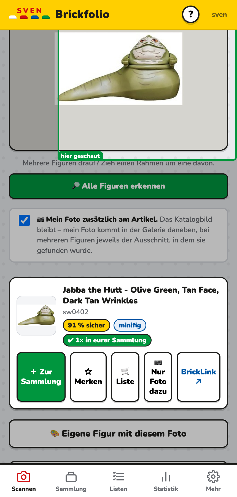
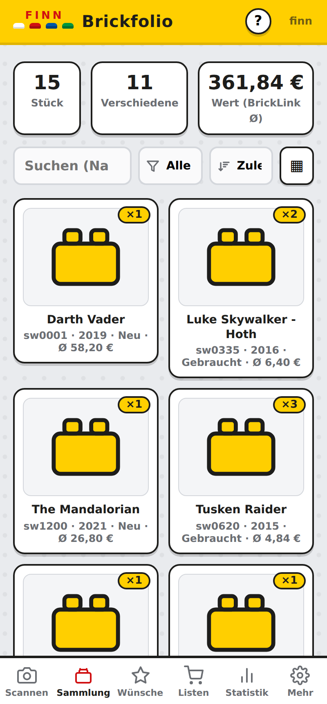
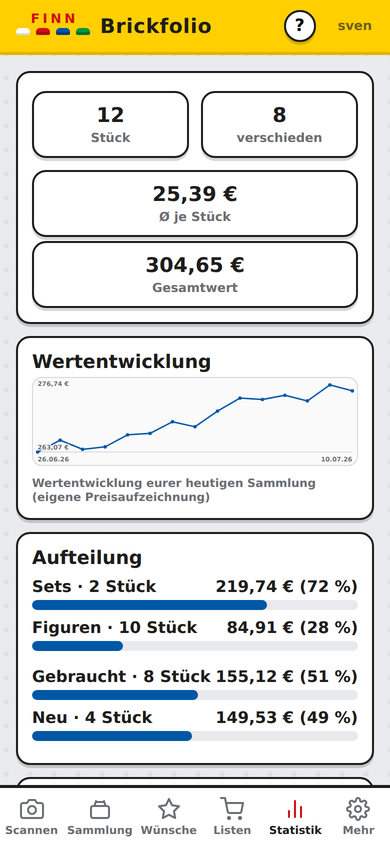
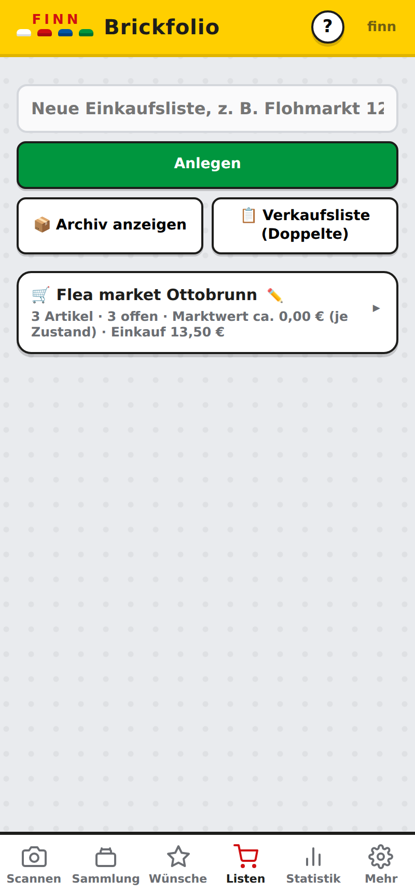
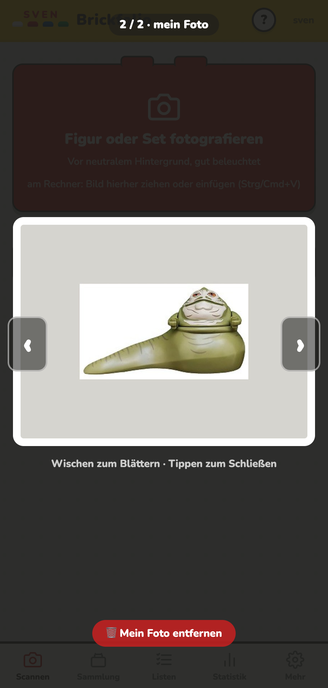
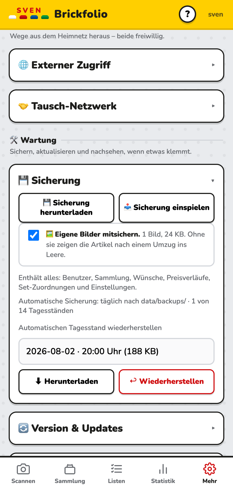

# Finn's Brickfolio 🧱

*[🇬🇧 English](README.en.md) · 🇩🇪 Deutsch*

[](https://buymeacoffee.com/melle79)
[](LICENSE)

Selbstgehostete PWA zum Scannen, Verwalten und Bewerten einer LEGO®-Sammlung –
gebaut für die ganze Familie auf einer gemeinsamen Datenbank, mit optionalem
**Sammlerprofi-Modus** für alle, die auf Flohmärkten kaufen und verkaufen.

**Foto → Erkennung → Sammlung.** Die Erkennung läuft über die kostenlose
[Brickognize-API](https://brickognize.com); Preise, Set-Inhalte und Metadaten
kommen von [BrickLink](https://www.bricklink.com) und
[Rebrickable](https://rebrickable.com) (eigene API-Keys nötig, siehe unten).

> 📖 Das ausführliche **Benutzerhandbuch** liegt unter
> [`docs/HANDBUCH.md`](docs/HANDBUCH.md) · [🇬🇧 English manual](docs/MANUAL.md).

## Funktionen

**Erfassen & Verwalten**
- 📷 Figuren und Sets direkt mit der Handykamera scannen (Kandidatenliste mit
  Trefferscore) oder per Name/Nummer suchen – reine Nummern werden automatisch
  als Set *und* Figur nachgeschlagen
- 📦 Mengen, Zustand (neu/gebraucht), Notizen, Bildergalerie, Volltextsuche
  (mit 🔍-Symbol und ✕ zum Leeren), Sortierung und Typ-Filter
- 🔎 Katalogsuche ab drei Zeichen, **10 Treffer pro Seite** mit „Weitere
  Ergebnisse laden" – alle Treffer sind erreichbar
- 👥 **Figuren beim Set übernehmen**: Beim Hinzufügen eines Sets fragt die App,
  welche der enthaltenen Minifiguren dabei sind (alle, keine oder eine Auswahl,
  inklusive Zustand) – ohne den Gesamtwert doppelt zu zählen
- 👥 Set-Vernetzung: Sets kennen ihre Figuren („👥 3/4 ✔"-Vollständigkeit),
  Figuren zeigen, in welchen euren Sets sie stecken; fehlende Set-Figuren
  landen mit einem Tipp gesammelt auf der Wunschliste
- 🖼 **Bild nachladen** je Eintrag, falls es fehlt oder nicht passt
- 📷 **Eigene Fotos am Artikel** – so wie die Bilder, die Käufer bei BrickLink
  beisteuern. Ein Kästchen über den Scan-Treffern hängt das Scan-Foto an alles,
  was ihr daraus anlegt; bei mehreren Figuren auf einem Bild bekommt **jede
  ihren eigenen Ausschnitt**. Das Katalogbild bleibt, euer Foto kommt in der
  Galerie daneben. Steht die Figur längst in der Sammlung, genügt **„📷 Nur
  Foto dazu"** – ohne eine zweite Zeile anzulegen
- 🔎 **Detailansicht überall**: Ein Tipp auf einen Such- oder Scan-Treffer
  öffnet ein Popup mit Jahr, Thema, Preisen und – bei Minifiguren – den
  **enthaltenen Teilen samt Farbnamen**
- 🎨 **Eigene Figuren (Custom)**: Eigenbauten mit selbst vergebener Nummer
  (die App zählt `custom-001`, `-002` … weiter) und eigenem Bild – wahlweise
  direkt das Foto aus dem Scan. Sie stehen in der Sammlung unter „Custom"
- 🗂️ **Themenkarten**: Sortiert nach Thema zeigt die Sammlung aufklappbare
  Karten (Star Wars, City, Custom …) mit Anzahl und Wert je Thema. Die zuletzt
  gewählte Sortierung merkt sich das Profil

**Preise & Wert**
- 💶 BrickLink-Ø-Preise (neu/gebraucht) automatisch im Hintergrund, mit
  eigener **Preisverlaufs-Aufzeichnung** und Chart pro Artikel
- 🌍 **Preisgebiet wählbar** (Mehr → Preisgebiet): weltweit, Deutschland,
  Österreich, Schweiz oder Europa – ohne Verkäufe im gewählten Gebiet weitet die
  App zweistufig aus (erst Europa, dann weltweit). Bestehende Preise lassen sich
  schrittweise umrechnen, preislose Artikel per Knopfdruck neu abrufen. Stammt
  ein Preis nicht aus dem eingestellten Gebiet, zeigt eine kleine **Flagge**
  (🇪🇺/🌍), woher er kommt
- 📊 **Statistik-Tab**: Kennzahlen, Wertentwicklung der Gesamtsammlung,
  Aufteilung nach Typ/Zustand, Wert nach Erscheinungsjahr, Top 10

**Wunschliste**
- ⭐ Merken aus jedem Scan/Suchergebnis, Ø-Preis-Widgets, „Gekauft"-Übernahme
  in die Sammlung inkl. Zustandswahl
- 🧩 Figuren, die zu einem eurer Sets gehören und noch fehlen, sind mit „fehlt
  zu eurem Set" gekennzeichnet – ein Tipp springt direkt zum Set

**Tausch-Netzwerk** (optional, mit Einladung)
- 🤝 Mehrere Brickfolio-Instanzen verbinden sich über einen kleinen
  **Tausch-Hub**: Jeder veröffentlicht die Artikel, die er abgeben möchte,
  und sieht die Angebote der anderen – mit Suche über Name und Nummer
- 🔢 **Selbst auswählen, was hineinkommt**, samt Menge: Von drei gleichen
  Figuren lässt sich auch nur eine anbieten. An jedem Artikel steht, ob er
  schon veröffentlicht ist
- 💬 **Nachrichten Ende-zu-Ende verschlüsselt** (X25519 + AES-256-GCM). Der
  Hub kann sie nicht lesen und löscht sie, sobald sie zugestellt sind; der
  lesbare Verlauf bleibt auf den beteiligten Instanzen. Im offenen Gespräch
  kommen neue Nachrichten von selbst an
- ✉️ **Einladungen mit Kontingent**: Jeder darf drei Freunde einladen und
  kann mehr anfragen. Ohne Einladung kommt niemand hinein
- ⚑ **Meldefunktion**: Läuft etwas schief, geht eine Meldung an den
  Hub-Admin – auf Wunsch mit dem Gesprächsverlauf, den die meldende Instanz
  selbst entschlüsselt und freiwillig offenlegt
- 🖼️ Eigene Figuren reisen mit **verkleinertem Vorschaubild**, damit beim
  Gegenüber kein Platzhalter steht

**Sammlerprofi-Modus** (Rolle, die der Admin pro Benutzer vergibt)
- 💰 Kaufpreis je Eintrag – automatisch mit dem BrickLink-Ø vom Erfassungstag
  vorbelegt (⚙️) oder manuell (✏️), mit Gewinn-/Verlust-Anzeige
- 🛒 **Einkaufslisten** für den Flohmarkt: befüllen per Scan, Marktwert live,
  Einkaufspreis je Artikel, **Gesamtangebot** mit anteiliger Verteilung nach
  Marktwert und 60-%-Preisvorschlag
- 📋 **Verkaufsliste**: alle Doppelten mit abgebbarer Menge und Verkaufswert –
  für eigene Sets gebrauchte Figuren bleiben reserviert, von allem anderen
  bleibt ein Behalte-Exemplar
- 🧩 **Fehlende Set-Figuren**: über alle eigenen Sets hinweg, welche Figuren
  noch fehlen (mit Anzahl, Sets, Nachkaufpreis) – einzeln oder alle auf die
  Wunschliste, als CSV oder Druckliste
- 🗒 Beim Verbuchen von einer Einkaufsliste landet der **Listenname in den
  Notizen** des Sammlungs-Eintrags (Herkunft bleibt nachvollziehbar)
- 📈 Zusätzliche Statistik: bezahlt gesamt, Gewinn, beste Wertsteigerungen

**Familie & Betrieb**
- 🔐 Mehrbenutzer mit Token-Login (PBKDF2-gehashte Passwörter), Admin- und
  Profi-Rollen (Admins können weitere Admins ernennen), eigene
  Passwort-/Namensänderung
- 💾 Komplett-**Sicherung** als JSON (herunterladen & wieder einspielen) –
  auf Wunsch **samt eurer eigenen Bilder**, damit nach einem Umzug nichts ins
  Leere zeigt. CSV-Export und druckfertige Listen gibt es dazu
- 🏷 Konfigurierbarer **Anzeigename** in Logo und Titel (Standard „Finn");
  ideal, wenn mehrere Familienmitglieder je eine eigene Instanz betreiben
- 🌌 Drei **Designs** zur Auswahl (Mehr → Design): „Klassisch" hell,
  „Galaxie" dunkel mit Sternenhimmel und „Nova" – ein modernes Glas-Design
  mit blauem Akzent; die Wahl gilt pro Gerät
- 🔔 **Hinweise auf dem Startbildschirm**: Ändert oder löscht BrickLink eine
  Nummer aus eurer Sammlung, steht das im Scannen-Tab – und bleibt dort, bis es
  jemand wegklickt. Die neue Nummer sucht die App im BrickLink Catalog Change
  Log und trägt sie auf Knopfdruck überall ein
- 🌐 **Externer Zugriff per Assistent** (Mehr → Externer Zugriff, Admin): baut
  aus deinem Cloudflare-Tunnel-Token den fertigen `docker-compose`-Block – Zugriff
  von unterwegs ohne Portfreigabe. Die App startet den Tunnel nicht selbst (kein
  Docker-Zugriff), der Token bleibt im Browser
- 🐞 **Fehlerbericht** (Mehr → Fehlerbericht, Admin): Fehler aus allen Geräten
  melden sich automatisch am eigenen Server und werden gleichartig
  zusammengefasst. Mit hinterlegtem GitHub-Token legt ein Klick daraus ein
  Issue an; API-Schlüssel und Token werden vorher aus dem Text entfernt
- 🖥 **Reagiert auf die Bildschirmbreite**: auf dem Handy Tab-Leiste unten, am
  Rechner Seitenleiste links mit breiterem Raster (vier bis fünf Karten pro
  Reihe) – dieselbe App, nur besser auf die Fläche verteilt
- ✨ **Moderne Darstellung**: Artikel öffnen sich als aufgeräumtes Popup, in
  der Sammlung schimmert das Produktbild als dezenter Kartenhintergrund
- 📲 Als PWA installierbar – auf dem Handy bietet die Scan-Seite das Ablegen
  **auf dem Startbildschirm** an (auf Android per Knopf, auf dem iPhone mit
  Anleitung) und blendet den Hinweis aus, sobald es liegt. Offline-Shell,
  keine Cloud – alles liegt auf eurem Server, **auch die Katalogbilder**:
  Die holt die Instanz einmal und liefert sie danach selbst, der Browser
  fragt also nie bei BrickLink, Rebrickable oder Brickognize an

## Screenshots

| Scannen | Sammlung |
|:---:|:---:|
|  |  |
| **Statistik** | **Einkaufsliste (Flohmarkt-Modus)** |
|  |  |
| **Eigene Fotos in der Galerie** | **Sicherung samt Bildern** |
|  |  |

*(Screenshots mit Demo-Daten. Statt Katalogbildern steht überall der
Platzhalter der App – fremdes Bildmaterial gehört nicht ins Repository. Die
Fotos in der Galerie sind selbst erzeugte Beispielbilder.)*

## Schnellstart (Docker)

Kein Quellcode, kein Bauen – zwei Befehle:

```bash
mkdir brickfolio && cd brickfolio
curl -sLo docker-compose.yml https://raw.githubusercontent.com/Melle79/brickfolio/main/docker-compose.example.yml
docker compose up -d
```

Aufrufen: `http://<server>:8300` – beim ersten Besuch führt der
**Einrichtungsassistent** durch alles Nötige: Admin-Konto, Anzeigename,
API-Schlüssel (mit Prüfen-Knopf) und, falls vorhanden, die Einladung ins
Tausch-Netzwerk. Überspringen geht überall; nachholen lässt sich alles unter
*Mehr*. Die Datenbank liegt persistent unter `./data/brickfolio.db`.

**Umzug von einer anderen Instanz?** Dann leg hier kein Konto an – im
Willkommens-Bogen steht **„📥 Sicherung einspielen"**. Der alte Stand kommt
samt Konten herüber; danach meldest du dich mit deinen bisherigen
Zugangsdaten an.

Das Image gibt es für **amd64** (Synology, Intel-NAS, PC) und **arm64**
(Raspberry Pi, ARM-NAS), auf zwei Registries – derselbe Build, nur zwei
Adressen:

| Registry | Name |
|---|---|
| GitHub Container Registry | `ghcr.io/melle79/brickfolio:latest` |
| Docker Hub | `melle79/brickfolio:latest` |

Die YAML oben nimmt `ghcr.io`. Docker Hub braucht ihr, wenn eure NAS-Oberfläche
eine **Suchmaske** für Images hat – die durchsucht meist nur Docker Hub.

### Synology NAS

Ganz ohne Konsole: **Container Manager → Projekt → Erstellen**, YAML einfügen,
fertig. Schritt für Schritt in [`docs/SYNOLOGY.md`](docs/SYNOLOGY.md).
Per SSH geht es genauso – Ordner unter `/volume1/docker/brickfolio` anlegen
und die Befehle oben mit `sudo` ausführen.

### Andere NAS-Systeme und Rechner

Es ist ein gewöhnliches OCI-Image auf zwei öffentlichen Registries – überall
dort, wo Container laufen, läuft auch Brickfolio. Dasselbe YAML wie oben,
nur an anderer Stelle eingefügt:

| System | Wo das YAML hingehört |
|---|---|
| **QNAP** | Container Station → *Anwendungen* → Erstellen |
| **UGREEN** | Docker → *Projekt* → Erstellen |
| **TerraMaster** | Docker Manager → *Compose* |
| **Asustor** | Portainer (aus App Central) → *Stacks* |
| **Unraid** | Docker-Reiter, oder *Compose Manager* aus den Community Apps |
| **TrueNAS SCALE** | Apps → *Custom App* (YAML) |
| **OpenMediaVault** | omv-extras → Compose → *Files* |
| **Linux / Raspberry Pi / Mac / Windows** | Ordner anlegen, `docker compose up -d` |

Gebaut wird für **amd64** und **arm64**. Sehr alte 32-Bit-ARM-Geräte
(`armv7`, z. B. ältere Einsteiger-NAS) werden nicht unterstützt.

**Unraid** hat es bequemer: Unter *Docker → Einstellungen →
Template Repositories* diese Adresse eintragen –

```
https://github.com/Melle79/unraid-templates
```

– danach steht Brickfolio unter *Docker → Add Container* in der
Vorlagen-Auswahl, mit vorbelegtem Port, `/data`-Pfad und den optionalen
Schlüsseln. Die Vorlage pflegen wir in
[Melle79/unraid-templates](https://github.com/Melle79/unraid-templates);
eine Kopie liegt hier unter [`unraid/brickfolio.xml`](unraid/brickfolio.xml).

### Bei einem Anbieter statt zu Hause

Wer keine eigene Hardware laufen lassen will, mietet die Instanz. **Sie
gehört dann dem, der sie anlegt** – Daten, Kosten und Zugang. Es gibt
weiterhin keinen Brickfolio-Dienst dazwischen.

| Anbieter | Weg | Anmerkung |
|---|---|---|
| **Render** | [](https://render.com/deploy?repo=https://github.com/Melle79/brickfolio) | Liest [`render.yaml`](render.yaml). Braucht den kleinsten **bezahlten** Tarif: Brickfolio benötigt eine dauerhafte Platte für `/data`, und die gibt es im kostenlosen Tarif nicht |
| **Railway** | Neues Projekt → *Deploy from GitHub* → dieses Repo, dann unter *Settings → Config-as-Code* `deploy/railway/railway.json` eintragen | Danach eine **Volume** auf `/data` legen, sonst ist die Sammlung nach jedem Neustart weg |
| **Coolify / Dokploy** | `docker-compose.example.yml` einfügen | Auf dem eigenen v-Server, volle Kontrolle |

> **Warum kein kostenloser Tarif?** Ohne dauerhafte Platte liegt die
> Datenbank im Container – bei jedem Neustart wäre die Sammlung weg. Lieber
> ein ehrlicher Hinweis als eine Bereitstellung, die still Daten verliert.

Wer keine Compose-Oberfläche hat, kommt auch so ans Ziel:

```bash
docker run -d --name brickfolio --restart unless-stopped \
  -p 8300:8300 -v /pfad/zu/data:/data \
  ghcr.io/melle79/brickfolio:latest
```

### Selbst bauen (statt fertiges Image)

Nur nötig, wenn du eigene Änderungen einspielen willst:

```bash
mkdir brickfolio && cd brickfolio
curl -sL https://github.com/Melle79/brickfolio/archive/refs/heads/main.tar.gz | tar xz --strip-components=1
cp docker-compose.example.yml docker-compose.yml
sed -i 's|image: ghcr.io/melle79/brickfolio:latest|build: .|' docker-compose.yml
docker compose up -d --build
```

(Auf Synology läuft die curl-Zeile mit Rechten am besten als
`sudo sh -c 'curl … | tar …'`, damit die ganze Pipe erfasst ist.)

## Konfiguration

| Variable | Pflicht | Beschreibung |
|---|---|---|
| `ADMIN_USER` / `ADMIN_PASSWORD` | nein | Optional: Admin automatisch anlegen (sonst Ersteinrichtung im Browser) |
| `DB_PATH` | nein | Pfad zur SQLite-Datei (Default im Container: `/data/brickfolio.db`) |
| `BL_CONSUMER_KEY` / `BL_CONSUMER_SECRET` / `BL_TOKEN` / `BL_TOKEN_SECRET` | nein | BrickLink-Store-API für Preise & Set-Inhalte ([Key beantragen](https://www.bricklink.com/v2/api/register_consumer.page)) |
| `BACKUP_KEEP` | nein | Automatische tägliche Sicherungen aufbewahren (Standard 14, 0 = aus) |
| `REBRICKABLE_KEY` | nein | Rebrickable-API für die Namenssuche ([Key erstellen](https://rebrickable.com/api/)) |
| `GITHUB_REPO` | nein | Ziel-Repository für Issues aus dem Fehlerbericht (Default `Melle79/brickfolio`) |

Alle API-Keys lassen sich alternativ **in der App** hinterlegen
(Mehr → API-Schlüssel, nur Admin) – ENV-Variablen dienen als Fallback.

## Rechte-Übersicht

| Aktion | Standard | Sammlerprofi | Admin |
|---|:-:|:-:|:-:|
| Scannen, Sammlung, Wünsche, Statistik | ✔ | ✔ | ✔ |
| Einkaufslisten sehen & Artikel „ist da" verbuchen | ✔¹ | ✔ | ✔¹ |
| Listen anlegen/befüllen/archivieren, Gesamtangebot, Verkaufsliste | – | ✔ | – |
| Kaufpreise & Gewinn sehen | – | ✔ | – |
| Benutzer, Rollen, API-Keys, Sicherung | – | – | ✔ |

¹ Tab erscheint nur, wenn mindestens eine aktive Liste existiert.
Rollen sind kombinierbar (der Admin kann sich selbst zum Profi machen).

## Updates & Backup

**Die App sagt Bescheid.** Unter *Mehr → Version & Updates* vergleicht sie die
laufende Version mit dem neuesten Release – unabhängig davon, wie du
installiert hast.

**Mit fertigem Image** (der Schnellstart oben) genügen zwei Befehle im
Projektordner:

```bash
docker compose pull && docker compose up -d
```

Auf einer Synology geht dasselbe ohne Konsole: *Container Manager → Projekt →
brickfolio → Aktion → Erstellen neu starten*.

> **Ohne Projekt, also von Hand aus der *Registrierung* geklickt?** Dann gibt
> es diesen Knopf nicht – ein Container kann sein Image nicht wechseln, und
> ohne YAML muss man ihn löschen und neu anlegen. Der Ablauf steht in
> [`docs/SYNOLOGY.md`](docs/SYNOLOGY.md). Wichtig dabei: Liegt kein Ordner auf
> `/data`, steckt die Datenbank in einem anonymen Volume und der neue
> Container bekommt ein leeres – **vorher sichern**.

Der Ordner `data/` bleibt dabei unberührt, Datenbank-Migrationen laufen beim
Start automatisch und sind idempotent. **Ein Schnappschuss vorher schadet
nie** – in der App unter *Mehr → Sicherung* die JSON-Datei herunterladen.

> `update.sh` und `update-watch.sh` liegen **nicht** im Image und nicht im
> Ordner, wenn du nur die `docker-compose.yml` geholt hast. Wer sie möchte
> (Schnappschuss automatisch, Update aus der App heraus), lädt sie einmalig
> dazu:
>
> ```bash
> curl -sLO https://raw.githubusercontent.com/Melle79/brickfolio/main/update.sh
> curl -sLO https://raw.githubusercontent.com/Melle79/brickfolio/main/update-watch.sh
> ```

**Aus dem Quellcode gebaut**: `sudo bash update.sh` im Projektordner. Das
Skript legt zuerst einen Datenbank-Schnappschuss an (die letzten drei bleiben
erhalten) und erkennt selbst, ob es das Image nachziehen oder neu bauen muss.

### Update aus der App heraus (optional)

**Völlig optional** – ohne Einrichtung ändert sich nichts, Updates laufen wie
gehabt über `update.sh` per SSH. Der Knopf in der App erscheint erst, wenn der
Helfer unten eingerichtet ist; vorher steht dort nur ein Hinweis darauf.

**Wie es funktioniert.** Die App führt das Update **nicht selbst** aus – sie
kann es gar nicht, denn sie läuft im Container. Sie legt nur die Markierung
`data/update-requested.json` ab. Ein kleines Skript auf dem Server greift die
auf und startet `update.sh`. So braucht die App **keinen Docker-Zugriff** –
den ins Container zu reichen käme faktisch Root auf dem Server gleich.

#### Einrichten

`update-watch.sh` regelmäßig aufrufen lassen. **Ein Takt von einer Minute
reicht** – das Update selbst dauert ohnehin ein bis drei Minuten.

**Synology (DSM):** Systemsteuerung → Aufgabenplaner → Erstellen →
Geplante Aufgabe → Benutzerdefiniertes Skript

| Reiter | Einstellung |
| --- | --- |
| Allgemein | Benutzer: **`root`** (sonst darf das Skript kein `docker compose`) |
| Zeitplan | Täglich · Start `00:00` · „Weiterhin innerhalb desselben Tages ausführen" ✔ · Wiederholen: **jede Minute** · Letzte Ausführungszeit: **`23:59`** |
| Aufgabeneinstellungen | Befehl: `sh /pfad/zu/brickfolio/update-watch.sh` |

> ⚠️ Die „Letzte Ausführungszeit" steht anfangs auf `00:59` – dann liefe die
> Aufgabe nur in der ersten Stunde des Tages. Unbedingt auf `23:59` stellen.

**Linux mit cron:** `* * * * * sh /pfad/zu/brickfolio/update-watch.sh`

#### Mehrere Instanzen

Betreibt ihr mehrere Brickfolios (je eigener Ordner mit eigener
`docker-compose.yml`), legt am besten **je Instanz eine eigene Aufgabe** an.
Das ist der robusteste Weg: Jede läuft unabhängig, und im Aufgabenplaner seht
ihr pro Instanz, ob sie durchgelaufen ist.

Wollt ihr trotzdem nur **eine** Aufgabe, hängt an jede Zeile `|| true`:

```sh
sh /volume1/docker/brickfolio/update-watch.sh || true
sh /volume1/docker/brickfolio-nerdfan/update-watch.sh || true
```

> ⚠️ Ohne `|| true` kann die zweite Zeile ausfallen: Bricht die erste mit einem
> Fehler ab (etwa fehlende Rechte), beendet der Aufgabenplaner das ganze
> Skript – die zweite Instanz bekommt dann nie ein Lebenszeichen.

Die Instanzen bleiben in jedem Fall unabhängig – jede hat ihre eigene
Markierung im eigenen `data`-Ordner, ein Update bei der einen rührt die andere
nicht an.

#### Ablauf

Admin wählt sofort / 1 Min / 5 Min → alle angemeldeten Browser zeigen einen
Countdown („bitte Eingaben abschließen"), danach einen Sperrbildschirm. Sobald
der Server wieder da ist, laden sich die Browser selbst neu. Solange der
Countdown läuft, kann der Admin abbrechen.

- Der Helfer hinterlässt bei jedem Lauf `data/update-watch-alive`. Daran
  erkennt die App, dass er eingerichtet ist – fehlt das Lebenszeichen länger
  als fünf Minuten, wird das Update gar nicht erst angeboten.
- Protokoll jedes Laufs: `data/update-watch.log`.
- Sicherung: In-App unter Mehr → Sicherung (JSON mit allen Daten inkl.
  Benutzern und Preisverläufen) **oder** einfach `data/brickfolio.db` kopieren.

## Technik

FastAPI + SQLite (ohne ORM) · Vanilla JS PWA (kein Build-Schritt) ·
Docker-Deployment · APIs: Brickognize, BrickLink Store API (OAuth1),
Rebrickable.

## Rechtliches

LEGO® ist eine Marke der LEGO Gruppe, die dieses Projekt weder sponsert noch
autorisiert oder unterstützt. BrickLink, Rebrickable und Brickognize sind
Marken ihrer jeweiligen Inhaber; für deren APIs gelten die jeweiligen
Nutzungsbedingungen. Dieses Projekt ist ein privates Hobby-Projekt ohne
kommerzielle Absicht.

Daten und Bilder stammen von Rebrickable (Katalogsuche), BrickLink (Preise,
Set-Inhalte, Bilder) und Brickognize (Bilderkennung – beim Abfotografieren
wird das Foto dorthin übertragen). Dieselben Angaben stehen in der App unter
**Mehr → Quellen & Rechtliches**.

Die Schrift **Nunito** (SIL Open Font License 1.1, Lizenztext unter
`frontend/fonts/OFL.txt`) wird lokal ausgeliefert – es werden also keine
Besucherdaten an Schrift-CDNs übertragen, und die Oberfläche sieht auch dann
richtig aus, wenn der Server keine Internetverbindung hat.

### Was ohne Internet funktioniert

Die Sammlung liegt vollständig auf eurem Server, die Oberfläche ebenso. Ist
der Server im Heimnetz erreichbar, aber ohne Internet, geht weiter:

- Sammlung, Wunschliste und Einkaufslisten ansehen und bearbeiten
- manuell erfassen, eigene Figuren samt eigenem Bild
- Statistik, CSV-Export und Drucklisten
- Sicherung herunterladen und einspielen

Auf das Internet angewiesen sind dagegen alle Funktionen, die nach außen
fragen: **Scannen** (Brickognize), **Namenssuche** (Rebrickable), **Preise
und Set-Inhalte** (BrickLink), die **Katalogbilder** (sie liegen auf deren
Servern – selbst hochgeladene Bilder nicht), die **Update-Prüfung** und das
**Tausch-Netzwerk**.

Ist gar kein Server erreichbar, lädt die installierte PWA zwar noch ihre
Oberfläche aus dem Zwischenspeicher, zeigt aber keine Daten – die kommen
immer live vom eigenen Server, nichts davon liegt im Browser.

## Unterstützen

Brickfolio ist ein privates Hobby-Projekt und kostenlos. Wenn es dir gefällt
und du die Entwicklung unterstützen magst, freue ich mich über einen Kaffee ☕

<a href="https://buymeacoffee.com/melle79"></a>

## Lizenz

[MIT](LICENSE)
